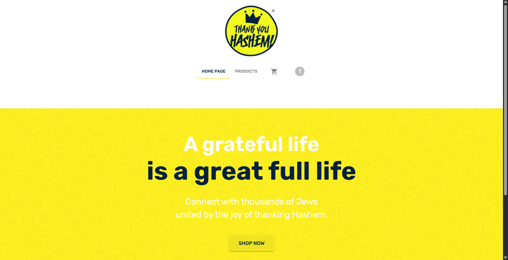
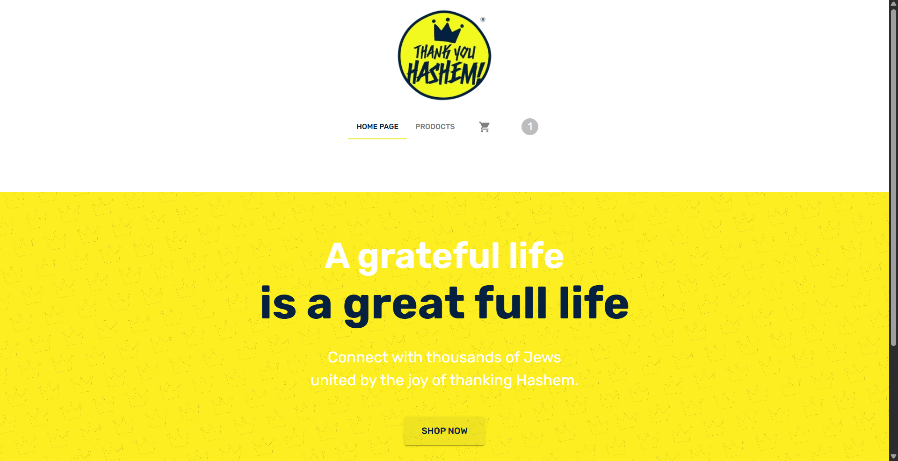
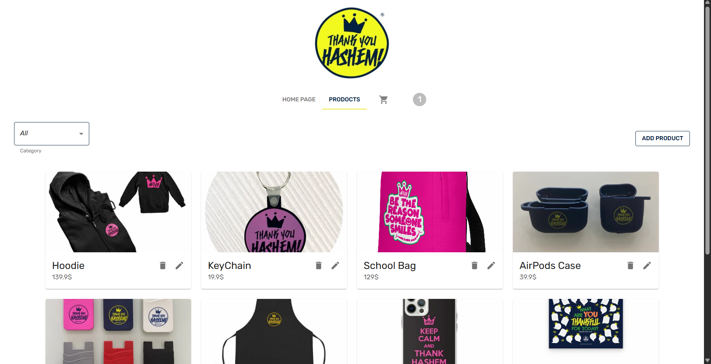
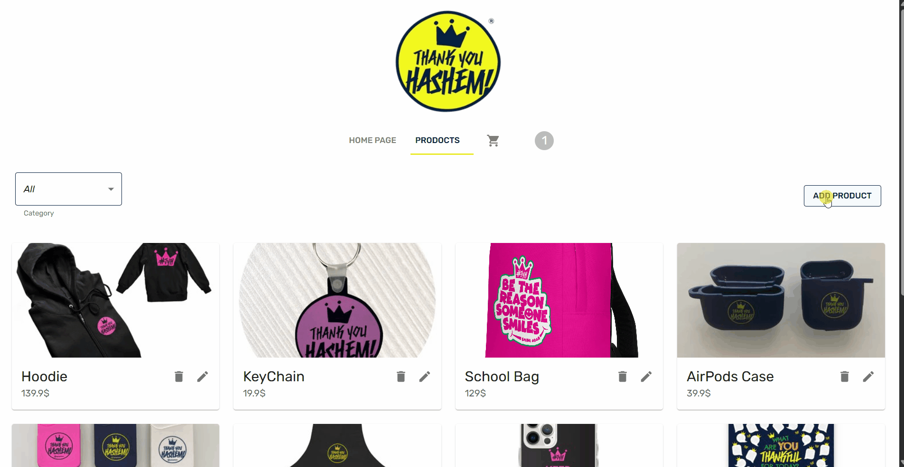
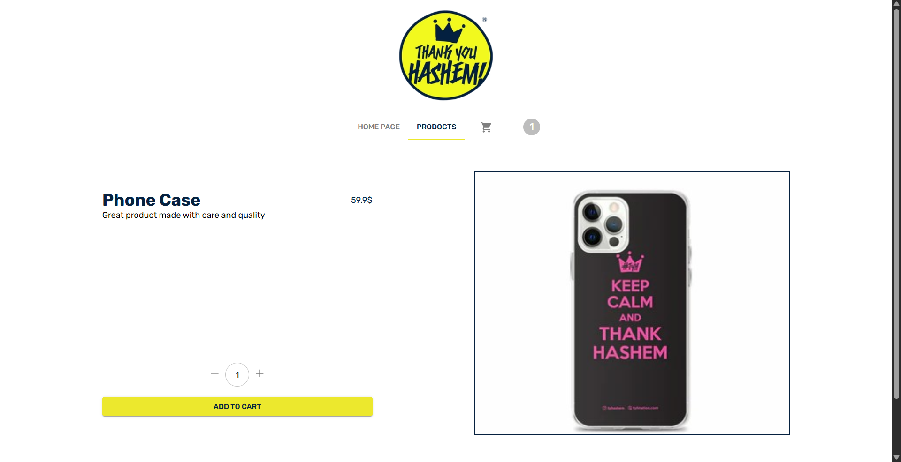
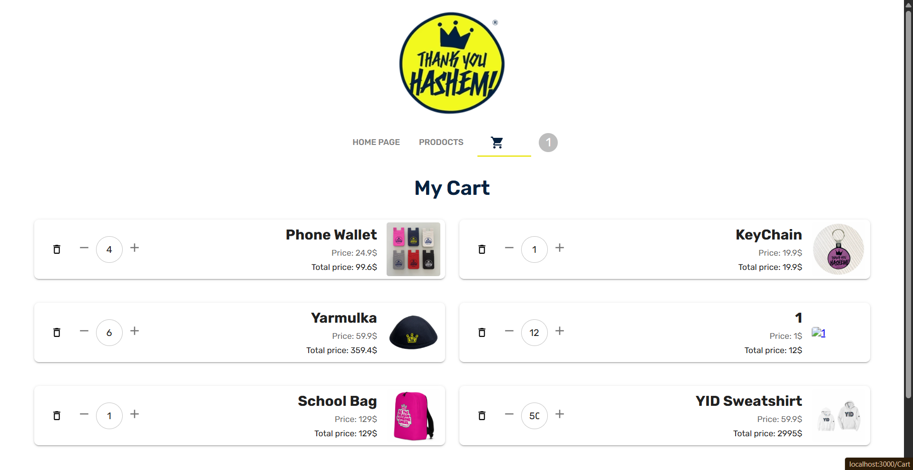
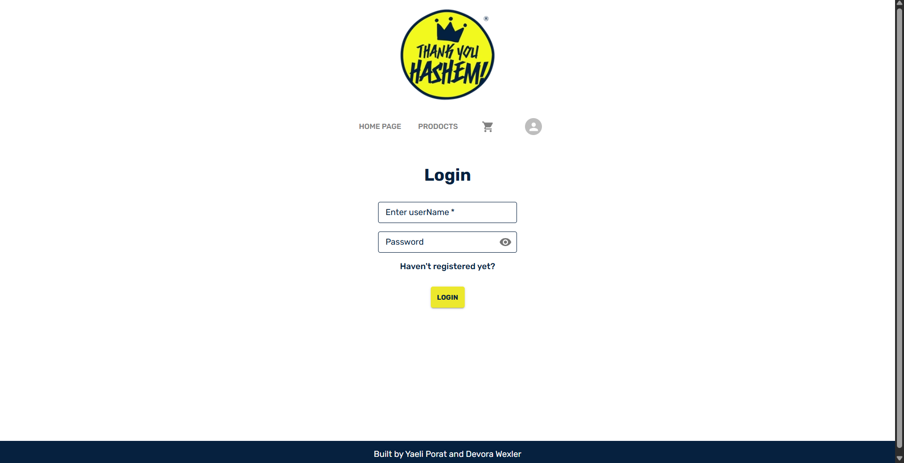

# TYH E-Commerce Project

A full-stack e-commerce web application built with the MERN stack (MongoDB, Express.js, React, Node.js). This project allows users to browse products, manage a shopping cart, and authenticate securely, while providing admin users with tools to manage the product catalog.



## Table of Contents

- [Features](#features)
- [Tech Stack](#tech-stack)
- [Installation](#installation)
- [Usage](#usage)
- [API Documentation](#api-documentation)
- [Project Structure](#project-structure)
- [Screenshots](#screenshots)

## Features

### User Features
- **User Registration & Login**: Secure authentication using JWT tokens
- **Product Browsing**: View products by category with pagination (6 products per page)
- **Product Details**: Detailed view of individual products
- **Shopping Cart**: Add, update, and remove items from cart
- **Responsive Design**: Mobile-friendly interface using Material-UI

### Admin Features
- **Product Management**: Add, update, and delete products
- **Role-Based Access**: Admin-only controls for product operations

## Tech Stack

### Frontend
- React 19.1.0
- React Router 7.6.2 for navigation
- Redux Toolkit 2.8.2 for state management
- Material-UI (MUI) 7.1.1 for UI components
- Axios 1.10.0 for API calls
- JWT-decode 4.0.0 for token handling

### Backend
- Node.js with Express 5.1.0
- MongoDB with Mongoose 8.15.1
- JWT (jsonwebtoken 9.0.2) for authentication
- bcrypt 6.0.0 for password hashing
- CORS configuration for cross-origin requests

## Installation

### Prerequisites
- Node.js (v14 or higher)
- MongoDB (local or cloud instance)
- npm or yarn

### Setup

1. **Clone the repository**
   ```bash
   git clone <repository-url>
   cd tyh-project
   ```

2. **Install server dependencies**
   ```bash
   cd server
   npm install
   ```

3. **Install client dependencies**
   ```bash
   cd ../client
   npm install
   ```

4. **Set up environment variables**
   
   Create a `.env` file in the `server` directory with:
   ```
   MONGO_URI=mongodb://localhost:27017/tyh-ecommerce
   JWT_SECRET=your-secret-key-here
   ```

5. **Start MongoDB**
   Ensure MongoDB is running on your system.

6. **Start the server**
   ```bash
   cd server
   npm start
   ```

7. **Start the client** (in a new terminal)
   ```bash
   cd client
   npm start
   ```

The application will be available at `http://localhost:3000` for the client and `http://localhost:5000` for the server API.

## Usage

### For Users
1. Register a new account or log in
2. Browse products on the home page or products page
3. Click on products to view details
4. Add items to your cart
5. View and manage your cart

### For Admins
1. Log in with an admin account
2. Access the "Add Product" feature from the header
3. Manage products (add, edit, delete)

## API Documentation

### Authentication Endpoints
- `POST /api/auth/Register` - Register a new user
- `POST /api/auth/Login` - Log in and receive JWT token

### Product Endpoints
- `GET /api/prod` - Get products (with pagination and category filter)
- `GET /api/prod/:id` - Get single product
- `POST /api/prod` - Add product (admin only)
- `PUT /api/prod` - Update product (admin only)
- `DELETE /api/prod` - Delete product (admin only)

### Cart Endpoints
- `GET /api/cart` - Get user's cart
- `POST /api/cart` - Add item to cart
- `PUT /api/cart` - Update item quantity
- `DELETE /api/cart` - Remove item from cart

## Project Structure

```
tyh-project/
├── client/                 # React frontend
│   ├── src/
│   │   ├── components/     # Reusable UI components
│   │   ├── redux/          # State management
│   │   └── ...
│   └── package.json
├── server/                 # Node.js backend
│   ├── Controllers/        # Route handlers
│   ├── models/            # MongoDB schemas
│   ├── routes/            # API routes
│   ├── middleWare/        # Authentication middleware
│   └── server.js
└── README.md
```

## Screenshots

### Home Page


### Products Page


### add product


### Product Details


### Shopping Cart


### Login Page


